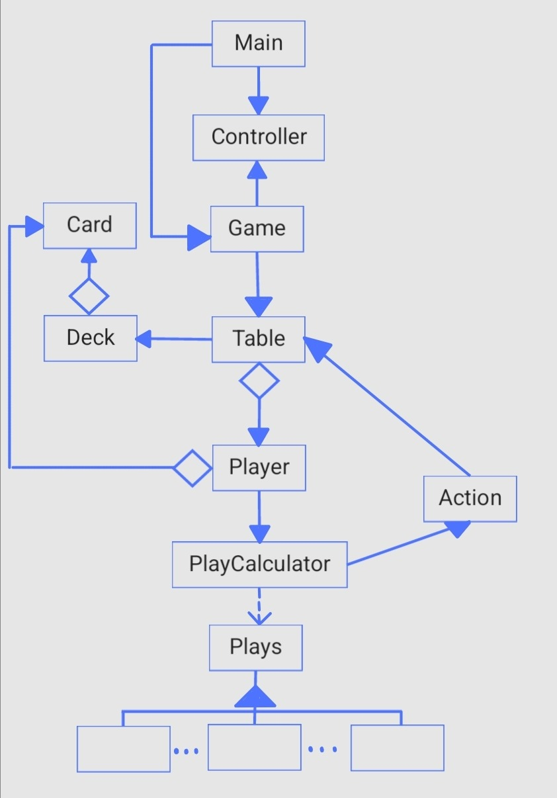
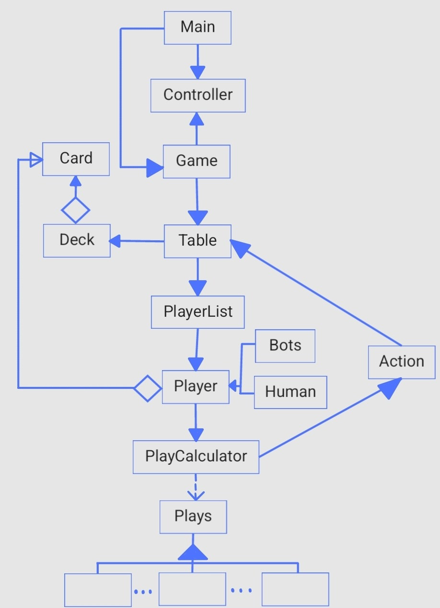
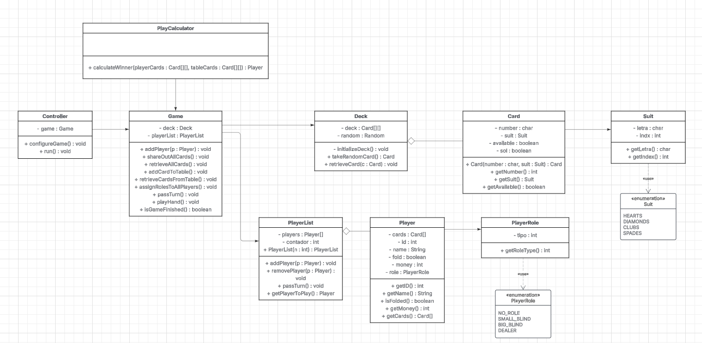

# TFG_Poker

# Integrantes:

- Óscar Fabian Pineda German
- Carla Toapanta Taipe
- Valeria Corina Pulido Lozada

# Requisitos del proyecto
- Java SDK 21
- JavaFX 21

# Patrones de diseño utilizados

- Singleton
- Builders /Cosntructores
- Tipos de cartas ---> abstract factory
- Comandos para el fold, check ..etc
- Observer ----> para las estadisticas
- Adapter ---> partidas json

# 18/09/2025
- Diagrama de clases general de la lógica del juego
- Creación proyecto en GitHub
- Organización de tareas en Projects
- Revisión proyectos ya realizados por Valeria y Óscar
  
  

# 23/09/2025
- Configuración del proyecto con wrapper de Maven, Java 21, JavaFX 21 y VSCode

# 29/09/2025
- Diagrama de clase más completo (https://lucid.app/lucidchart/d3f7ede4-6c95-4eab-ac28-97cf29b15127/edit?invitationId=inv_d0d21d1d-be79-4cfb-9e71-16f0b3f42e50)

# 02/10/2025
## CASOS DE USO:
- Repartir/devolver cartas: jugador y mesa
- Asignar roles
- Eliminar/añadir jugadores
- Configurar parámetros de la partida
- Jugar una mano: apostar y opciones de ronda (check, bet, call, raise, fold)
- Gestionar ganador en cada ronda
# 09/10/2025
- Lista de tareas para sprint-backlog

# 16/10/2025
- Bucle de jugar mano, hacer jugada, rotar, asignar roles : Pendientes de review
- Correccion de devolver cartas
# 22/10/2025
- Primer debug del proyecto
- Clases para mostrar el estado del juego en el debug
- Lista de comando para realizar jugada

# 05/11/2025
- Configuracion basica para la interfaz java fx
- Visualizar logica por consola, (comandos)
- Algoritmo evaluador jugadas
